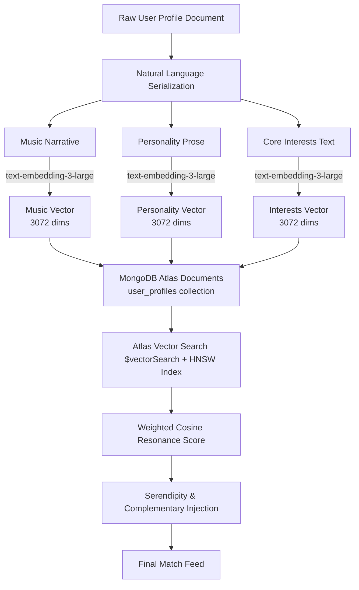

# Viberr — Semantic Resonance Matching Engine

**Viberr** moves beyond superficial swipe culture by replacing rigid rule-based filtering with a **high-dimensional semantic resonance architecture**. Rather than matching users on exact keyword overlap, our neural matchmaking engine comprehends nuanced personality traits, musical sensibilities, and ideological compatibility natively inside **MongoDB Atlas**.

---

## 🚀 Key Platform Features & Tech Stack

While the heart of SoulMatter is its vector matching engine, the application delivers a seamless, premium user experience built on modern web infrastructure:

- **⚡ Tech Stack Architecture**:
  - **Frontend**: **Next.js** (App Router, Tailwind CSS, Framer Motion animations, layered glassmorphism UI).
  - **Backend**: **Node.js & Express.js** REST API handling authentication, real-time interactions, and embedding generation.
  - **Database & Vector Store**: **MongoDB Atlas** (Unified document storage and native HNSW vector indexing via `$vectorSearch`).
- **🔥 Tinder / TikTok-Style Matchmaking**: Full-bleed, snap-scrolling interface where each potential candidate fills the entire screen. Users swipe or tap to connect based on dynamic **Semantic Resonance Badges** showing personalized compatibility reasoning.
- **💬 Full-Screen Instant Messaging**: Snapchat-inspired immersive messaging window that slides over the global navigation, complete with audio/video call utilities, real-time chat history, and Instagram-style close-friends story circles.

---

## 🧠 Architecture & Algorithm Overview

Our matching system transforms user identities into mathematical representations within a vector space, evaluating interpersonal resonance across multiple psychological and cultural dimensions using unified document-vector storage.



---

## 1. Natural Language Profile Serialization

The quality of semantic retrieval depends fundamentally on the input representation. Traditional matchmaking platforms embed raw JSON objects or isolated keyword arrays (e.g., `{"hobbies": ["coffee", "hiking"]}`). Because large embedding models are trained on continuous natural language corpora, raw structured data leads to degraded semantic representations.

In SoulMatter, every user profile document is synthesized into **rich, descriptive narrative prose** before embedding:

> *"Loves indie rock, shoegaze, and ambient electronic. Favorite artists: Radiohead, Beach House, Slowdive. Interests: philosophy, hiking, film photography. Personality: introverted, creative, high openness, low neuroticism. Relationship style: slow-burn, values deep conversation."*

By serializing profiles into coherent contextual narratives, the embedding model captures latent semantic relationships—such as understanding that *shoegaze*, *film photography*, and *introverted creativity* occupy adjacent conceptual regions in neural space.

---

## 2. High-Dimensional Vector Embeddings

To capture the vast complexity of human personality, we utilize high-capacity transformer embedding models.

| Embedding Model | Dimensionality | Best For | Architecture Role |
| :--- | :--- | :--- | :--- |
| **`text-embedding-3-large`** | **3,072 dims** | Maximum semantic nuance | **Primary SoulMatter Engine** |
| `embed-v3` | 1,024 dims | High semantic similarity | Secondary comparison baseline |
| `bge-m3` | 1,024 dims | Self-hosted privacy | On-premise deployments |

At **3,072 dimensions**, `text-embedding-3-large` provides sufficient geometric separation to distinguish between subtly different psychological profiles that lower-dimensional models conflate into generic clusters.

---

## 3. Native MongoDB Atlas Vector Search

Rather than introducing external vector database dependencies that require complex ETL pipelines and synchronization logic, SoulMatter leverages **MongoDB Atlas Vector Search** as a unified data platform.

### 📦 Co-Located Document & Vector Storage
High-dimensional embedding arrays (`embedding`, `music_vector`, etc.) are stored directly inside the user's MongoDB BSON document alongside rich profile metadata (bio, age, location, Spotify links). This eliminates network hops across dual infrastructures and guarantees strict data consistency.

### ⚡ `$vectorSearch` & HNSW Indexing
Under the hood, MongoDB Atlas maintains dedicated **Hierarchical Navigable Small World (HNSW)** vector indexes optimized for cosine similarity traversal. Matching queries execute natively through the aggregation pipeline:

```json
{
  "$vectorSearch": {
    "index": "vector_index",
    "path": "embedding",
    "queryVector": "[ ...3072 floats... ]",
    "numCandidates": 150,
    "limit": 20,
    "filter": {
      "age": { "$gte": 21, "$lte": 35 },
      "location.city": "New York"
    }
  }
}
```

Crucially, MongoDB performs **single-stage pre-filtering** within the `$vectorSearch` stage. Hard constraints (such as age limits or location bounds) are evaluated *during* graph traversal rather than as a post-filter, ensuring lightning-fast Approximate Nearest Neighbor (ANN) retrieval without candidate depletion.

---

## 4. Multi-Vector Weighted Strategy

Human connection is multi-faceted: two individuals may share an identical taste in obscure music while possessing entirely incompatible communication styles. To account for this, SoulMatter stores separate vector fields within each MongoDB document:
1. `music_vector` — Synthesized from acoustic preferences and sonic aesthetics.
2. `personality_vector` — Derived from Big Five psychometric indicators and behavioral traits.
3. `interests_vector` — Built from creative endeavors, intellectual pursuits, and lifestyle habits.

At query time, overall semantic resonance is computed via a dynamically weighted linear combination of cosine similarities across distinct `$vectorSearch` or aggregation stages:

\[
\text{Resonance Score} = w_1 \cdot \cos(\vec{u}_{\text{music}}, \vec{v}_{\text{music}}) + w_2 \cdot \cos(\vec{u}_{\text{personality}}, \vec{v}_{\text{personality}}) + w_3 \cdot \cos(\vec{u}_{\text{interests}}, \vec{v}_{\text{interests}})
\]

Where our default equilibrium weights are set to:
\[
\text{Score} = 0.40 \cdot \text{Music} + 0.40 \cdot \text{Personality} + 0.20 \cdot \text{Interests}
\]

---

## 5. Preventing the "Echo Chamber" Problem

Pure semantic similarity exhibits a critical failure mode in social matching: it surfaces **clones**. Connecting an anxious introvert exclusively with identical anxious introverts frequently produces stagnant friction.

SoulMatter counteracts algorithmic echo chambers through three deliberate design interventions inside our retrieval pipeline:

### ⚡ Complementary Matching
We apply geometric transformation rules to specific psychometric axes. For dimensions like *Extraversion* or *Dominance*, the engine seeks **complementary vectors** rather than exact overlays—pairing high openness with anchoring stability to foster interpersonal balance.

### 🎲 Serendipity Injection
If every recommendation represents the absolute top-1 nearest neighbor, the user experience becomes predictable and sterile. Our retrieval pipeline deliberately injects controlled randomness by surfacing **Serendipity Sparks**—candidates sitting in the **70%–85% cosine similarity band** who possess tangential, unexpected points of connection.

### 🔄 Dynamic Feedback Loop
Implicit signals (dwell time on full-screen cards, message initiation rates) and explicit signals (connections, passes) are stored as interaction documents in MongoDB and continuously analyzed. Over time, this feedback fine-tunes the individual's dimensional weights (\(w_1, w_2, w_3\)), evolving the matching algorithm alongside the user's personal growth.
